**JOBSHEET 7 APLIKASI OCR SEDERHANA  DENGAN  FLUTTER**

## 👩‍🎓 Identitas
- Nama: Aprilia Putri Anggraeni  
- NIM: 2341760043  
- Kelas: 3F – SIB/05  

--------------------------------------------------------------------------------------------------------------------------------------------------
**4.LANGKAH KERJA**
**<br>4.1. Langkah 1: Buat Proyek Baru**
<br>Buka terminal, lalu jalankan:

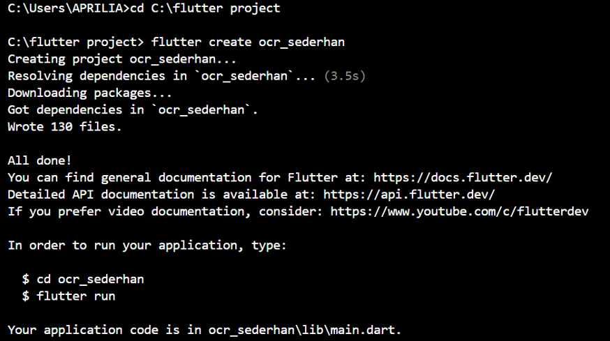

**4.2. Langkah 2: Tambahkan Plugin**
<br>Buka file pubspec.yaml, lalu tambahkan dependensi berikut di bawah bagian dependencies :

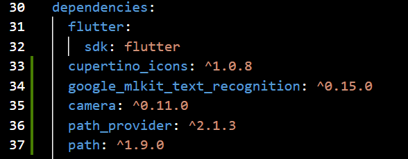

Simpan file, lalu jalankan:

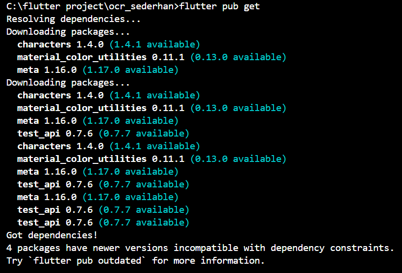

**4.3. Langkah 3: Tambahkan Izin Kamera (Android)**
<br>Buka file: android/app/src/main/AndroidManifest.xml
<br>Tambahkan baris berikut di dalam tag <manifest>, sebelum <application>:
<br><uses - permission  android:name =" android . permission . CAMERA "  / >


**4.4. Langkah 4: Buat Struktur Folder**
<br>Di dalam folder lib/, buat struktur berikut:

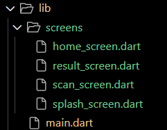

**5. KODE PROGRAM**
**<br>5.1.File: lib/main.dart**
```dart
import 'package:flutter/material.dart';
import 'screens/splash_screen.dart';

void main () {
  runApp (const MyApp()) ;
}

class MyApp extends StatelessWidget {
  const MyApp ({super.key}) ;

  @override
  Widget build (BuildContext context) {
    return MaterialApp (
      title : 'OCR Sederhana',
      theme : ThemeData (primarySwatch: Colors.blue),
      home : const SplashScreen (),
      debugShowCheckedModeBanner : false,
    );
  }
}
```

**<br>5.2.File: lib/screens/splash screen.dart**
```dart
import 'dart:async';
import 'package:flutter/material.dart';
import 'home_screen.dart';

class SplashScreen extends StatefulWidget {
  const SplashScreen({super.key});

  @override
  State<SplashScreen> createState() => _SplashScreenState();
}

class _SplashScreenState extends State<SplashScreen> {
  @override
  void initState() {
    super.initState();
    Timer(const Duration(seconds: 2), () {
      Navigator.pushReplacement(
        context,
        MaterialPageRoute(builder: (_) => const HomeScreen()),
      );
    });
  }

  @override
  Widget build(BuildContext context) {
    return Scaffold(
      backgroundColor: Colors.blue,
      body: Center(
        child: Column(
          mainAxisAlignment: MainAxisAlignment.center,
          children: const [
            CircularProgressIndicator(color: Colors.white),
            SizedBox(height: 20),
            Text(
              'OCR Scanner',
              style: TextStyle(color: Colors.white, fontSize: 24),
            ),
          ],
        ),
      ),
    );
  }
}
```

**<br>5.3.File: lib/screens/home screen.dart**
```dart
import 'package:flutter/material.dart';
import 'scan_screen.dart';

class HomeScreen extends StatelessWidget {
  const HomeScreen({super.key});

  @override
  Widget build(BuildContext context) {
    return Scaffold(
      appBar: AppBar(title: const Text('Menu Utama')),
      body: Center(
        child: ElevatedButton(
          onPressed: () {
            Navigator.push(
              context,
              MaterialPageRoute(builder: (_) => const ScanScreen()),
            );
          },
          child: const Text('Mulai Scan Teks'),
        ),
      ),
    );
  }
}
```

**<br>5.4.File: lib/screens/scan screen.dart**
```dart
import 'dart:io';
import 'package:flutter/material.dart';
import 'package:camera/camera.dart';
import 'package:google_mlkit_text_recognition/google_mlkit_text_recognition.dart';
import 'package:path_provider/path_provider.dart';
import 'result_screen.dart';

late List<CameraDescription> cameras;

class ScanScreen extends StatefulWidget {
  const ScanScreen({super.key});

  @override
  State<ScanScreen> createState() => _ScanScreenState();
}

class _ScanScreenState extends State<ScanScreen> {
  CameraController? _controller; // gunakan nullable agar aman
  late Future<void> _initializeControllerFuture;

  @override
  void initState() {
    super.initState();
    _initCamera();
  }

  /// Inisialisasi kamera
  void _initCamera() async {
    try {
      cameras = await availableCameras();
      _controller = CameraController(
        cameras.first,
        ResolutionPreset.medium,
      );

      _initializeControllerFuture = _controller!.initialize();
      await _initializeControllerFuture;

      if (mounted) {
        setState(() {});
      }
    } catch (e) {
      debugPrint('Error initializing camera: $e');
    }
  }

  @override
  void dispose() {
    _controller?.dispose();
    super.dispose();
  }

  /// Proses OCR dari file gambar
  Future<String> _ocrFromFile(File imageFile) async {
    final inputImage = InputImage.fromFile(imageFile);
    final textRecognizer = TextRecognizer(script: TextRecognitionScript.latin);
    final RecognizedText recognizedText =
        await textRecognizer.processImage(inputImage);
    textRecognizer.close();
    return recognizedText.text;
  }

  /// Ambil foto lalu pindah ke halaman hasil
  Future<void> _takePicture() async {
    if (_controller == null) return;

    try {
      await _initializeControllerFuture;

      if (!mounted) return;

      ScaffoldMessenger.of(context).showSnackBar(
        const SnackBar(
          content: Text('Memproses OCR, mohon tunggu...'),
          duration: Duration(seconds: 2),
        ),
      );

      final XFile image = await _controller!.takePicture();
      final ocrText = await _ocrFromFile(File(image.path));

      if (!mounted) return;
      Navigator.push(
        context,
        MaterialPageRoute(
          builder: (_) => ResultScreen(ocrText: ocrText),
        ),
      );
    } catch (e) {
      if (!mounted) return;
      ScaffoldMessenger.of(context)
          .showSnackBar(SnackBar(content: Text('Error: $e')));
    }
  }

  @override
  Widget build(BuildContext context) {
    // Jika controller belum siap, tampilkan loading
    if (_controller == null || !_controller!.value.isInitialized) {
      return const Scaffold(
        body: Center(
          child: CircularProgressIndicator(),
        ),
      );
    }

    return Scaffold(
      appBar: AppBar(
        title: const Text('Kamera OCR'),
        centerTitle: true,
        backgroundColor: Colors.deepPurple,
      ),
      body: Column(
        children: [
          Expanded(
            child: AspectRatio(
              aspectRatio: _controller!.value.aspectRatio,
              child: CameraPreview(_controller!),
            ),
          ),
          Padding(
            padding: const EdgeInsets.all(16.0),
            child: ElevatedButton.icon(
              style: ElevatedButton.styleFrom(
                backgroundColor: Colors.deepPurple,
                padding:
                    const EdgeInsets.symmetric(horizontal: 24, vertical: 12),
                shape: RoundedRectangleBorder(
                  borderRadius: BorderRadius.circular(12),
                ),
              ),
              onPressed: _takePicture,
              icon: const Icon(Icons.camera_alt, color: Colors.white),
              label: const Text(
                'Ambil Foto & Scan',
                style: TextStyle(color: Colors.white),
              ),
            ),
          ),
        ],
      ),
    );
  }
}
```

**<br>5.5.File: lib/screens/result screen.dart**
```dart
import 'package:flutter/material.dart';

class ResultScreen extends StatelessWidget {
  final String ocrText;

  const ResultScreen({super.key, required this.ocrText});

  @override
  Widget build(BuildContext context) {
    return Scaffold(
      appBar: AppBar(title: const Text('Hasil OCR')),
      body: Padding(
        padding: const EdgeInsets.all(16.0),
        child: SingleChildScrollView(
          child: SelectableText(
            ocrText.isEmpty
                ? 'Tidak ada teks ditemukan.'
                : ocrText.replaceAll('\n', ' '),
            style: const TextStyle(fontSize: 18),
          ),
        ),
      ),
    );
  }
}
```

**6. TUGAS PRAKTIKUM**
<br>1. Jalankan aplikasi di emulator atau HP.

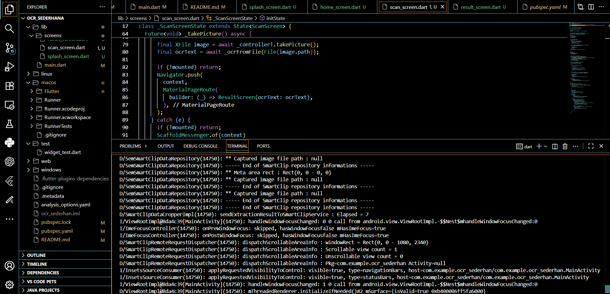

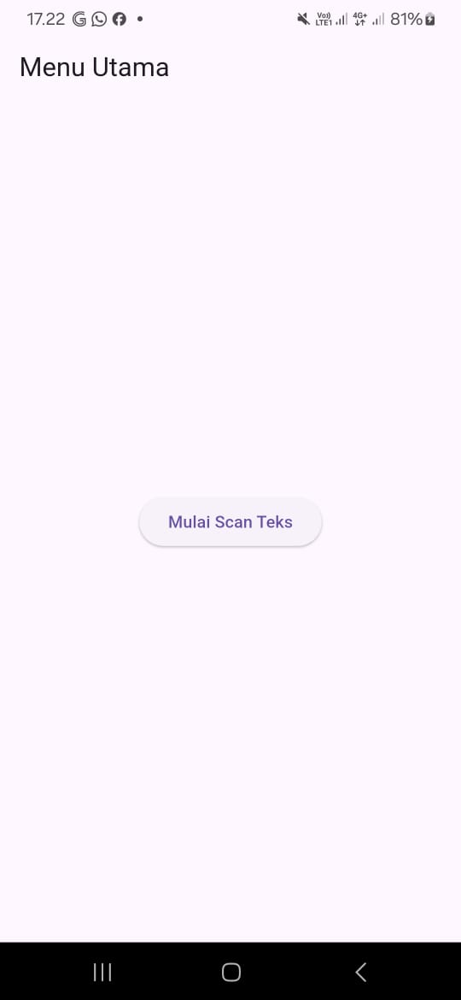

<br>2. Lakukan scan terhadap teks cetak (misal: buku, koran, atau layar HP).

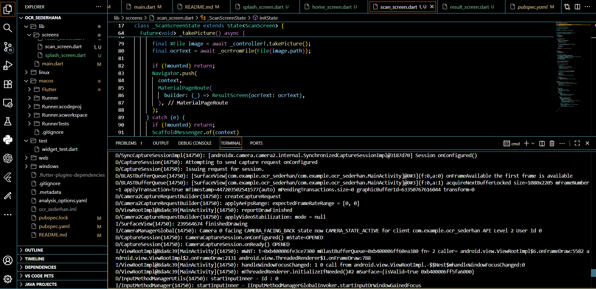

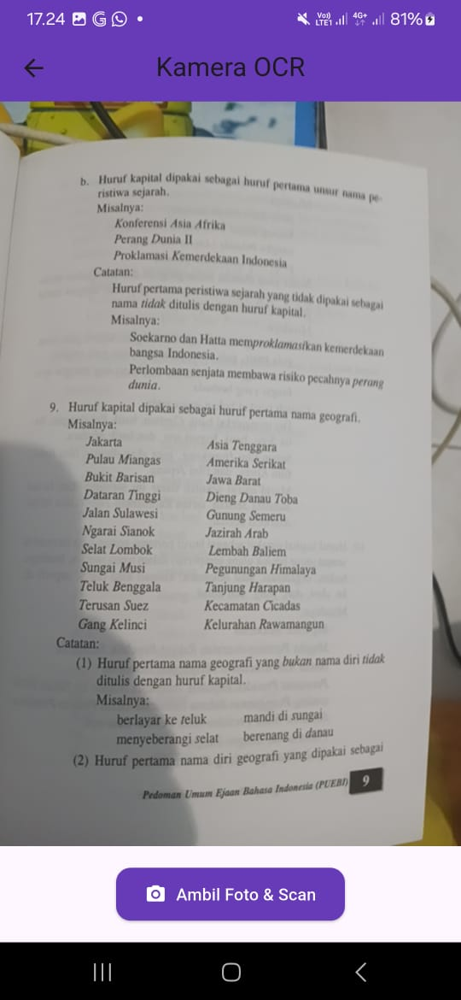

<br>3. Amati hasil OCR yang muncul

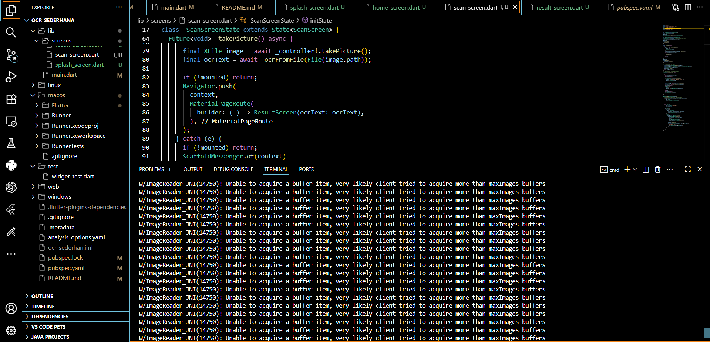


<br>4. Jawab pertanyaan berikut:
<br>a. Apakah semua teks terbaca dengan akurat? Mengapa?
**<br>Jawab :** Tidak semua teks terbaca dengan akurat.
Hal ini disebabkan oleh beberapa faktor seperti pencahayaan yang kurang, kualitas kamera yang rendah, teks yang buram atau miring, jenis font yang tidak standar, serta kontras warna antara teks dan latar belakang yang kurang jelas. OCR bekerja optimal jika teks tercetak rapi dan gambar hasil tangkapan jelas.
<br>b. Apa kegunaan fitur OCR dalam kehidupan sehari-hari?
**<br>Jawab :** Fitur OCR (Optical Character Recognition) berguna untuk mengubah teks cetak menjadi teks digital secara otomatis, sehingga memudahkan penyimpanan, pengeditan, dan pencarian informasi tanpa perlu mengetik ulang.
Contohnya untuk mendigitalkan dokumen, membaca teks dari gambar, atau menerjemahkan teks langsung dari kamera.
<br>c. Sebutkan 2 contoh aplikasi nyata yang menggunakan OCR!
**<br>Jawab :** 
<br>1. Google Lens – untuk mengenali dan menyalin teks dari gambar atau kamera secara langsung.
<br>2. Microsoft Office Lens / Adobe Scan – untuk memindai dokumen kertas menjadi file digital (PDF atau Word) yang bisa diedit.

<br>
<br>

**UJIAN TENGAH SEMESTER (UTS) PRAKTIKUM**
**<br>Instruksi Awal (SETUP) - Wajib**
<br>1. Pastikan proyek ocr_sederhana sudah diinisialisasi sebagai repositori Git dan ter
hubung ke akun GitHub Anda.
<br>2. Lakukan commit awal untuk memastikan branch main Anda bersih.

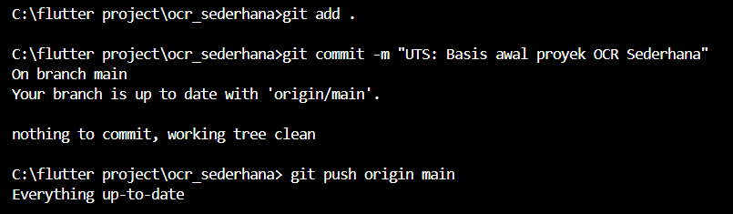

 **Soal 1: Modifikasi Struktur Navigasi dan Aliran**
 **<br>1. Pengubahan Navigasi Home**
 <br>• UbahElevatedButtondiHomeScreen(lib/screens/home_screen.dart) menjadi *widget* **ListTile**.

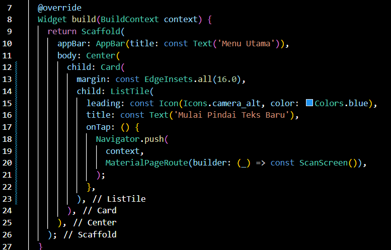

 <br>• AturListTile: leading: Icon(Icons.camera_alt, color: Colors.blue);title: Text(’Mulai Pindai Teks Baru’).


 <br>• Fungsi onTap harus menggunakan Navigator.push() untuk ke ScanScreen

 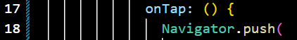

 **2. Teks Utuh dan Navigasi Balik**
<br>• DiResultScreen(lib/screens/result_screen.dart), hapus fungsi ocrText.replaceAll(’\n’,”) agar hasil teks ditampilkan dengan baris baru (\n) yang utuh.

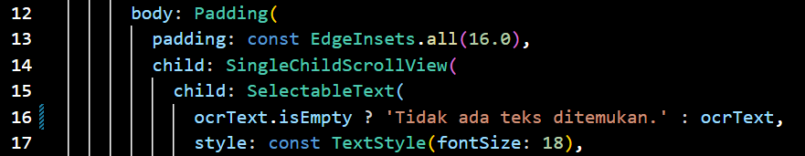

 <br>• Tambahkan FloatingActionButton dengan ikon Icons.home.

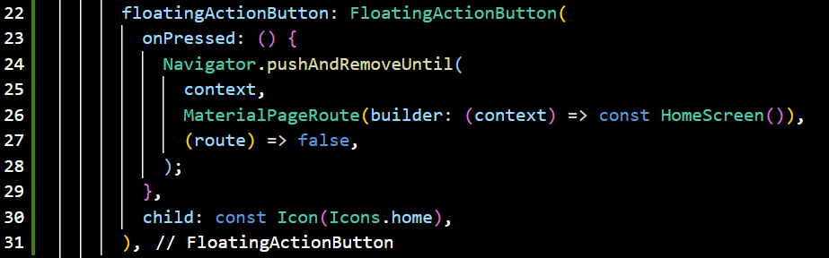

 <br>• Ketika tombol ditekan, navigasi harus kembali langsung ke HomeScreen menggunakan **Navigator.pushAndRemoveUntil()** (atau metodeyang setara) untuk menghapus semua halaman di atasnya dari stack navigasi.

 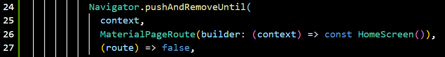

 **Perintah Commit Wajib (Soal 1)**
 <br>Setelah Soal 1 selesai, lakukan commit dan push dengan pesan:
 ```dart
 git add lib/screens/home_screen.dart lib/screens/result_screen.dart
 git commit -m "UTS: Selesai Soal 1- ListTile dan Navigasi Balik"
 git push origin main
 ```

 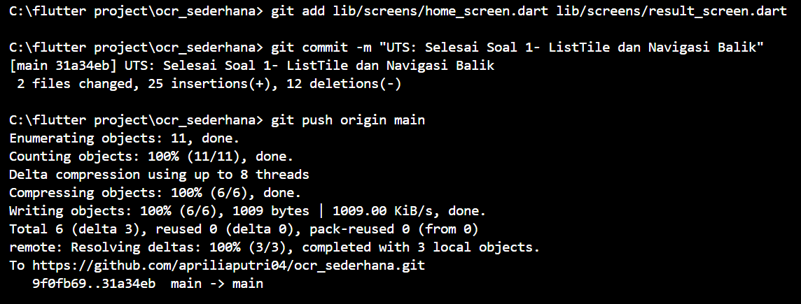

 **Soal 2: Penyesuaian Tampilan dan Penanganan State/Error**
 **<br>1. Custom Loading Screen di ScanScreen**
 <br>• DiScanScreen(lib/screens/scan_screen.dart), modifikasi tampilan *loading* yang muncul sebelum kamera siap (if (!controller.value.isInitialized)) :


 <br>• Latar Belakang: Scaffold(backgroundColor: Colors.grey[900]).

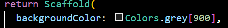

 <br>• Isi: Di dalam Center, tampilkan Column berisi CircularProgressIndicator(color:Colors.yellow).

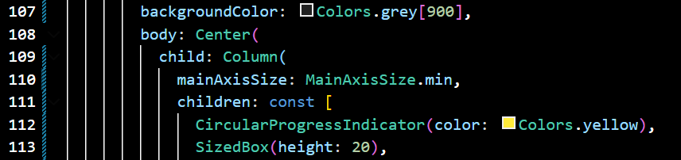

 <br>• Di bawah indikator, tambahkan Text(’Memuat Kamera... Harap tunggu.’,style: TextStyle(color: Colors.white, fontSize: 18)).

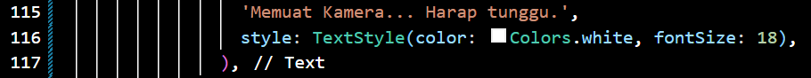

 **<br>2. Spesifikasi Pesan Error**
 <br>• Di fungsi _takePicture() pada ScanScreen, modifikasi blok catch (e) untuk mengubah pesan *error* pada SnackBar.

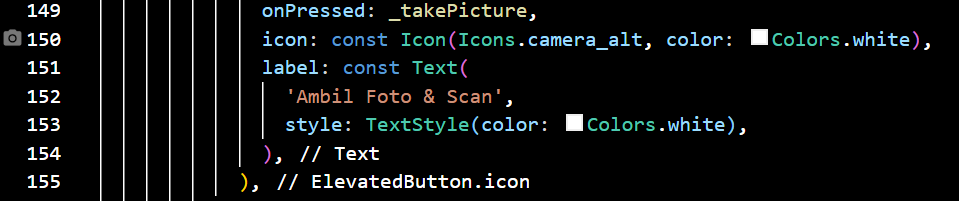

<br>• Pesan SnackBar harus berbunyi: "Pemindaian Gagal! Periksa Izin Kamera atau coba lagi." (Hilangkan variabel *error* ($e))

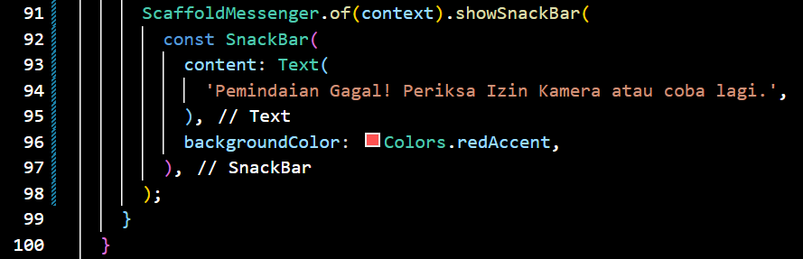

**Perintah Commit Wajib (Soal 2)**
<br> Setelah Soal 2 selesai, lakukan commit dan push dengan pesan:
```dart
 git add lib/screens/scan_screen.dart
 git commit -m "UTS: Selesai Soal 2- Tampilan Loading dan Error"
 git push origin main
```

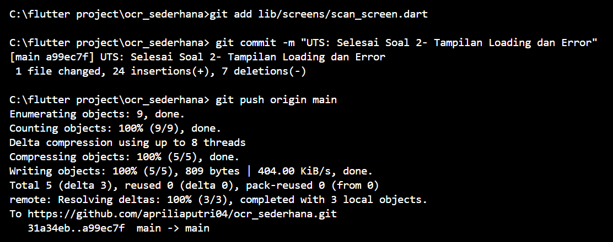

**Soal 3: Implementasi Plugin Text-to-Speech (TTS)**
**<br>1. Instalasi Plugin**
<br>• Tambahkan *plugin* flutter_tts ke dalam file pubspec.yaml (gunakan versi terbaru yang kompatibel).

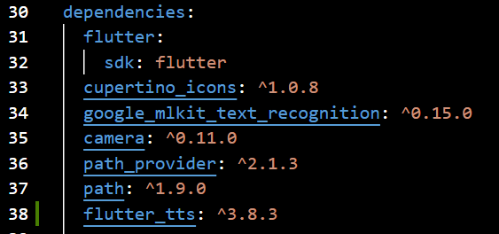

<br>• Jalankan flutter pub get

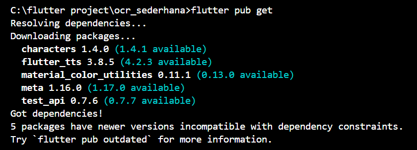

**<br>2. Konversi Widget dan Inisialisasi**
<br>• Ubah ResultScreen dari StatelessWidget menjadi **StatefulWidget**.

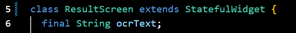

<br>• Di initState(), inisialisasi FlutterTts dan atur bahasa pembacaan menjadi Bahasa Indonesia.

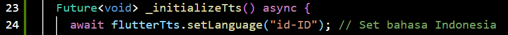

<br>• Implementasikan dispose() untuk menghentikan mesin TTS saat halaman ditutup.

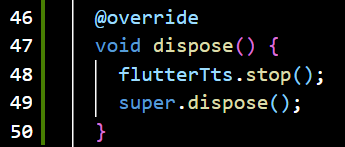

**<br>3. Fungsionalitas Pembacaan**
<br>• TambahkanFloatingActionButtonkeduadiResultScreen (atau ganti AppBar dengan action button) dengan ikon Icons.volume_up.

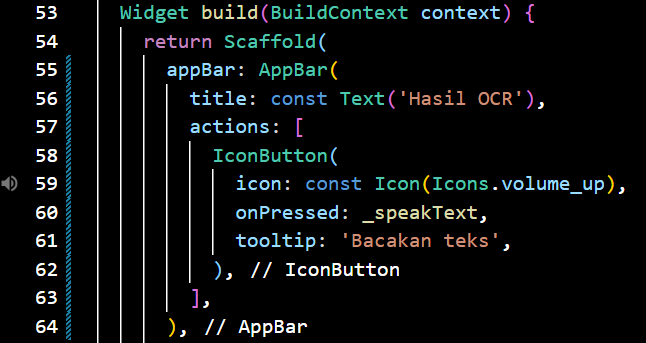

<br>• Ketika tombol ditekan, panggil fungsi speak() pada FlutterTts untuk membacakan seluruh isi ocrText.

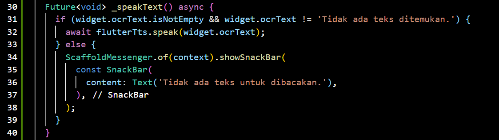

**Perintah Commit Wajib (Soal 3)**
<br>Setelah Soal 3 selesai, lakukan commit dan push terakhir dengan pesan:
```dart
git add pubspec.yaml lib/screens/result_screen.dart
git commit -m "UTS: Selesai Soal 3- Implementasi Flutter TTS"
git push origin main
```

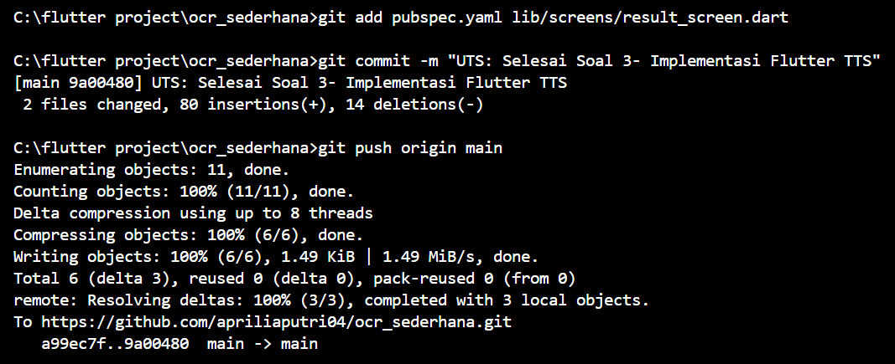

**Output**


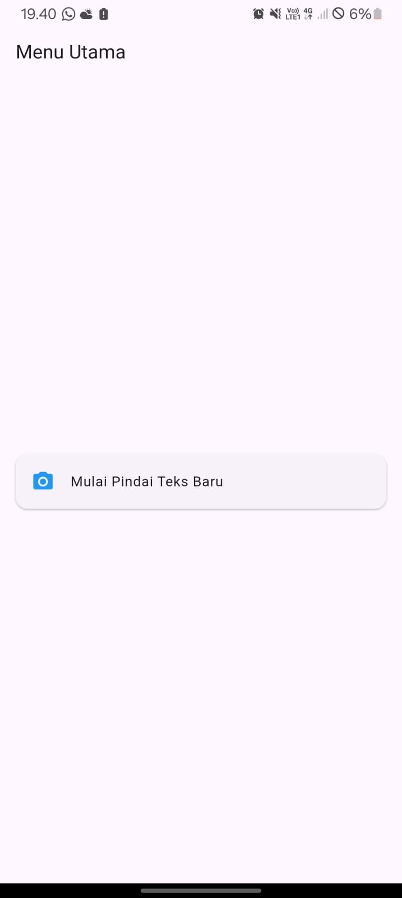

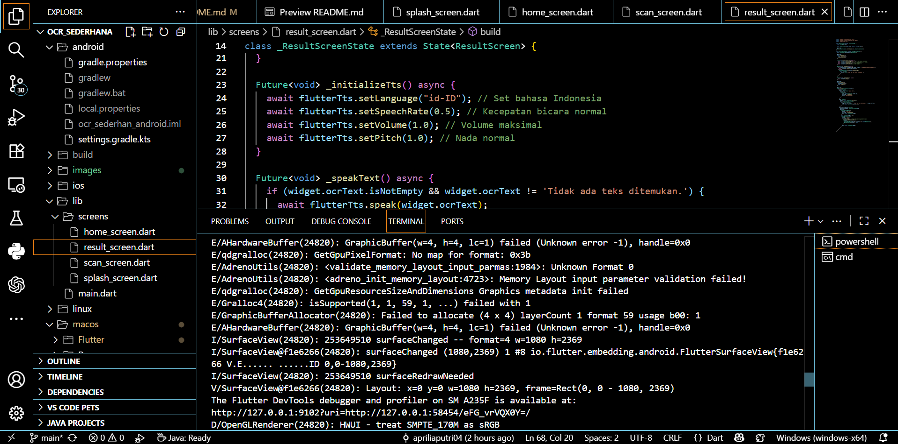

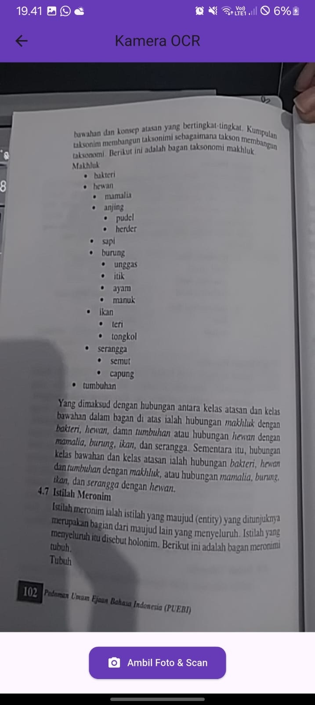


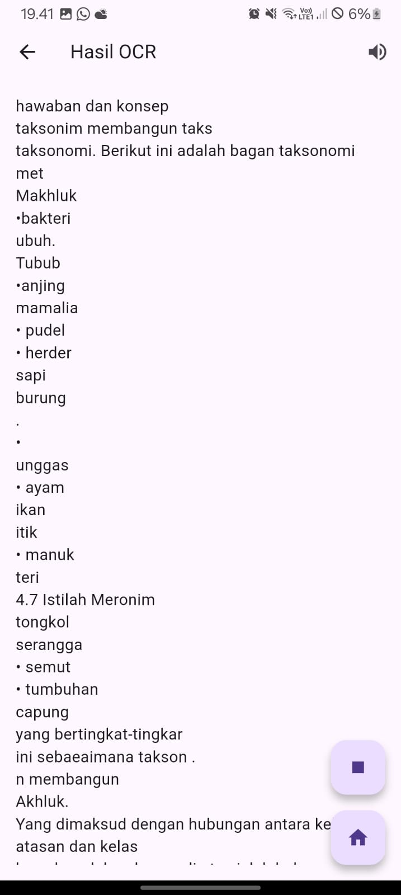

